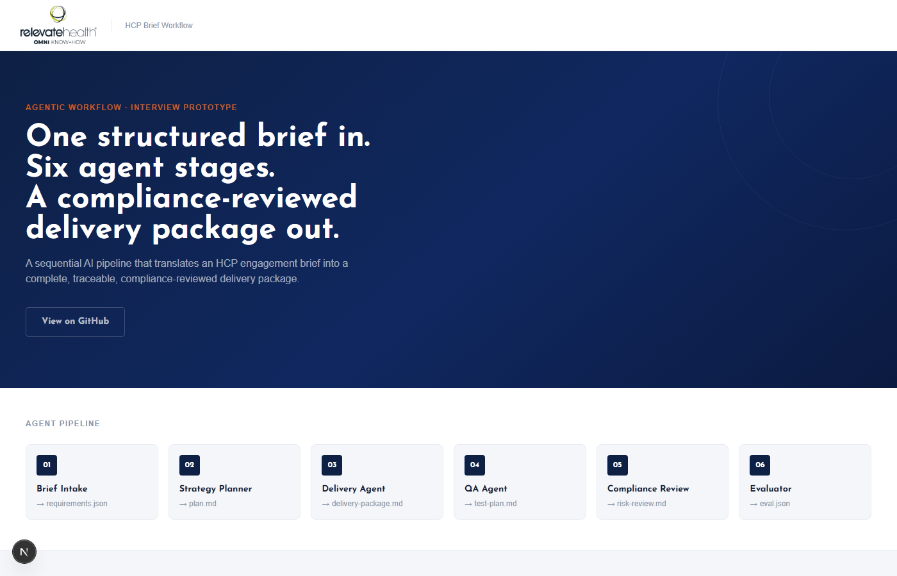
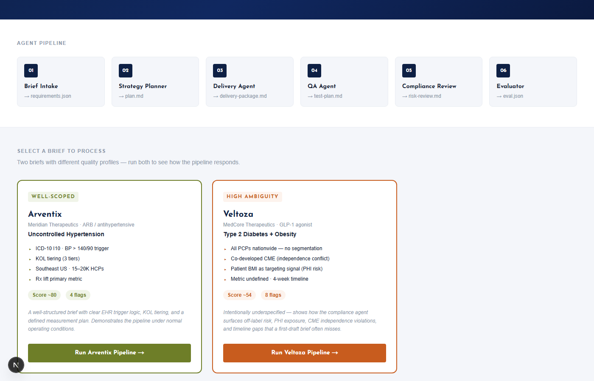

# HCP Brief Workflow Demo

**🔗 Live demo: [hcp-brief-demo.vercel.app](https://hcp-brief-demo.vercel.app)**

A 6-stage agentic pipeline that reads a structured HCP engagement brief in markdown and produces a complete, traceable, compliance-reviewed delivery package — requirements, execution plan, delivery handoff, QA test plan, risk review, and a calibrated evaluation score.

---

## Screenshots

### Homepage — Brief Selector





### Pipeline Run & Results


---

## Why This Is Relevant to Relevate Health

Relevate Health operates at the intersection of HCP engagement, omnichannel activation, and data-driven precision targeting — including EHR point-of-care placement, KOL influence scoring, Rx lift measurement, and next-best-action sequencing. This prototype mirrors those patterns in pipeline form:

- **Structured intake** of unstructured brand briefs → validated requirements JSON
- **KOL tier logic**, MIPS quality measure targeting, and EHR trigger criteria parsed and surfaced automatically
- **Compliance and risk review** as a dedicated agent stage, not an afterthought
- **AgentOps-style observability** — per-stage timing, token usage, and status in `trace.json`
- **Calibrated evaluation scoring** across five quality dimensions with human-review flags

This is adjacent prototype work — not a representation of any internal Relevate process. The brand (Cardivex / Meridian Therapeutics) and indication (fictional ARB for hypertension) are illustrative. No real PHI, no real HCP data.

---

## Architecture

```
        briefs/sample-brief.md
                │
                ▼
   ┌──────────────────────────┐
   │ 1. Brief Intake Agent    │  → requirements.json  (Zod-validated)
   └──────────────────────────┘
                │
                ▼
   ┌──────────────────────────┐
   │ 2. Strategy Planner      │  → plan.md
   └──────────────────────────┘
                │
                ▼
   ┌──────────────────────────┐
   │ 3. Delivery Agent        │  → delivery-package.md
   └──────────────────────────┘
                │
         ┌──────┴──────┐
         ▼             ▼
   ┌───────────┐ ┌───────────────────┐
   │ 4. QA     │ │ 5. Compliance     │  (parallel)
   │ Agent     │ │ Review            │
   └───────────┘ └───────────────────┘
    → test-plan.md  → risk-review.md
         │             │
         └──────┬──────┘
                ▼
   ┌──────────────────────────┐
   │ 6. Evaluator Agent       │  → eval.json + summary.md
   └──────────────────────────┘
                │
                ▼
   runs/<run-id>/
     requirements.json   plan.md   delivery-package.md
     test-plan.md        risk-review.md   eval.json
     trace.json          summary.md       report.html
```

Each agent is a single focused LLM call. Prompts live in `prompts/` as plain markdown — editable without touching TypeScript. The pipeline is sequential; a stage failure halts the run with upstream artifacts preserved.

---

## Tech Stack

| Layer | Choice |
|---|---|
| Runtime | Node.js (ESM) + TypeScript |
| Execution | `tsx` — runs TS directly, no compile step |
| AI API | Claude 3 Haiku via OpenRouter (OpenAI-compatible) |
| Schema validation | Zod |
| Observability | Custom AgentOps-style tracer → `trace.json` |
| Reporting | Self-contained `report.html` — no framework, no bundler |
| Testing | Vitest (ESM-native) |
| Config | `dotenv` |

---

## Setup

### Prerequisites
- Node.js 20+
- An OpenRouter API key (free tier works; paid Haiku tier recommended for full 6-stage runs)

### Install
```bash
npm install
```

### Configure
```bash
cp .env.example .env
# add your OPENROUTER_API_KEY to .env
```

### Run
```bash
npm run demo
# or: npx tsx src/index.ts briefs/sample-brief.md
```

Artifacts land in `runs/<run-id>/`. Open `report.html` in a browser for the visual summary.

### Test
```bash
npm test          # 10 unit tests — schema, tracer, fs helpers
npm run typecheck
```

---

## Sample Run

A pre-generated run ships in `runs/sample-run/` — no API key required to review outputs:

```bash
ls runs/sample-run/
# delivery-package.md   eval.json     plan.md
# requirements.json     risk-review.md  summary.md
# test-plan.md          trace.json
```

Start with `runs/sample-run/summary.md` for a plain-English overview.

---

## Artifact Guide

| File | Stage | What it contains |
|---|---|---|
| `requirements.json` | Intake | Zod-validated structured extraction. Empty fields = honest gap signal. |
| `plan.md` | Planner | Phased execution plan with surfaced ambiguities. |
| `delivery-package.md` | Delivery | Operational handoff: audience table, trigger criteria, suppression rules, out-of-scope. |
| `test-plan.md` | QA | 8 test categories: happy path, incomplete brief, conflicting criteria, overbroad audience, wrong channel, missing compliance, edge cases, adversarial. |
| `risk-review.md` | Compliance | Severity-ranked flags with recommendations. |
| `eval.json` | Evaluator | 0–1 scores across 5 dimensions + human-review flags array. |
| `trace.json` | All stages | Per-stage timing, token counts, status, retries — AgentOps observability surface. |
| `summary.md` | Pipeline | Plain-English run summary for non-technical stakeholders. |
| `report.html` | Pipeline | Self-contained visual report. Open directly in browser. |

---

## Sample Brief

The included brief (`briefs/sample-brief.md`) simulates a real HCP engagement initiative:

- **Brand:** Cardivex (fictional ARB / Meridian Therapeutics)
- **Indication:** Uncontrolled hypertension in high-cardiovascular-risk patients
- **Trigger logic:** ICD-10 I10 + BP > 140/90 + KOL Influence Score ≥ 4.0
- **Channels:** EHR point-of-care sidebar → on-demand CME → 48h follow-up email
- **Targeting:** MIPS Quality Measure #236, Southeast US, primary care + cardiology
- **Primary metric:** Rx lift ≥ 12% at 90 days vs. matched control cohort

---

## Known Limitations

- **No structured outputs.** JSON is extracted via regex. Production would use the SDK's tool-use contract.
- **No human-in-the-loop checkpoint.** Compliance flags are generated but there is no reviewer sign-off gate before the evaluator runs.
- **Self-graded evaluation.** Scores are not calibrated against a labeled human-review set.
- **No persistent run store.** Runs are written to local disk only.
- **No streaming.** Each stage waits for the full response before the next begins.

---

## Disclaimer

Fictional prototype for interview demonstration purposes only. Not legal, regulatory, or clinical advice. Does not reflect any internal Relevate Health system or workflow. No real PHI, no real HCP data, no real brand assets.
